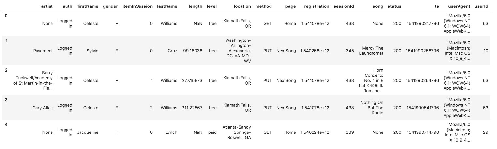
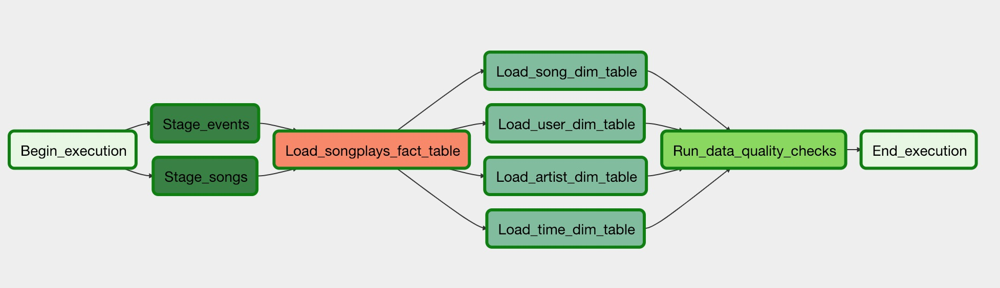
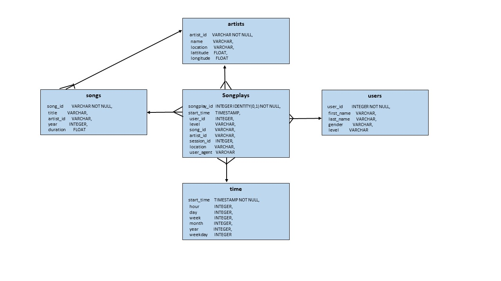

# Data Pipelines using Apache Airflow

## Description
This project introduces more automation and monitoring data warehouse ETL pipelines using Apache Airflow for 
the music streaming company, Sparkify.  It creates custom operators to perform tasks: staging the data, filling 
the data warehouse, and running checks on the data to catch any discrepencies in the datasets.  The source data is 
on S3 (consisting JSON logs about user activity in the music app and metadata regarding songs users listen).  
This data is processed on data warehouse in the Amazon Redshift.

## Dataset
Two datasets reside in S3, as per following links for each.

    Song data: s3://udacity-dend/song_data
    Log data: s3://udacity-dend/log_data

Example of sample song data (metadata about a song and the artist of that song)

    {"num_songs": 1, "artist_id": "ARJIE2Y1187B994AB7", "artist_latitude": null, "artist_longitude": null, "artist_location": "", "artist_name": "Line Renaud", "song_id": "SOUPIRU12A6D4FA1E1",
     "title": "Der Kleine Dompfaff", "duration": 152.92036, "year": 0}
     
Example of sample log data (Sparkify music app activity logs generated by simulation)

## DAG
Creating and Executing custom operators to perform the tasks - staging the data, filling the data warehouse, 
and running checks on the data.

## Project Package

1. DAG template - all the imports and task templates 

2. Operators - Stage, Fact and Dimension, Data Quality

3. Helper Class - SQL trasformation 

## How to Run:

1. Create Amazon Redshift cluster 'redshift-cluster'

2. Run the server and scheduler 

	root@134aff19a9c7:/home/workspace#/opt/airflow/start.sh
    
    Click Access Airflow to access UI

3. Add Airflow connections - configure with AWS credentials and connection to Redshift

## Database

Using the song and event datasets, a star schema is created for performing queries on song play analysis. Star schema includes the following tables:

### Fact Tables    
    1. songplays - record in log data associated with song plays (records with page = NextSong)
    
### Dimension Tables
    2. users - users in the app
    3. songs - song in music database
    4. artists - artists in music database
    5. time - timestamps of records in songplays

